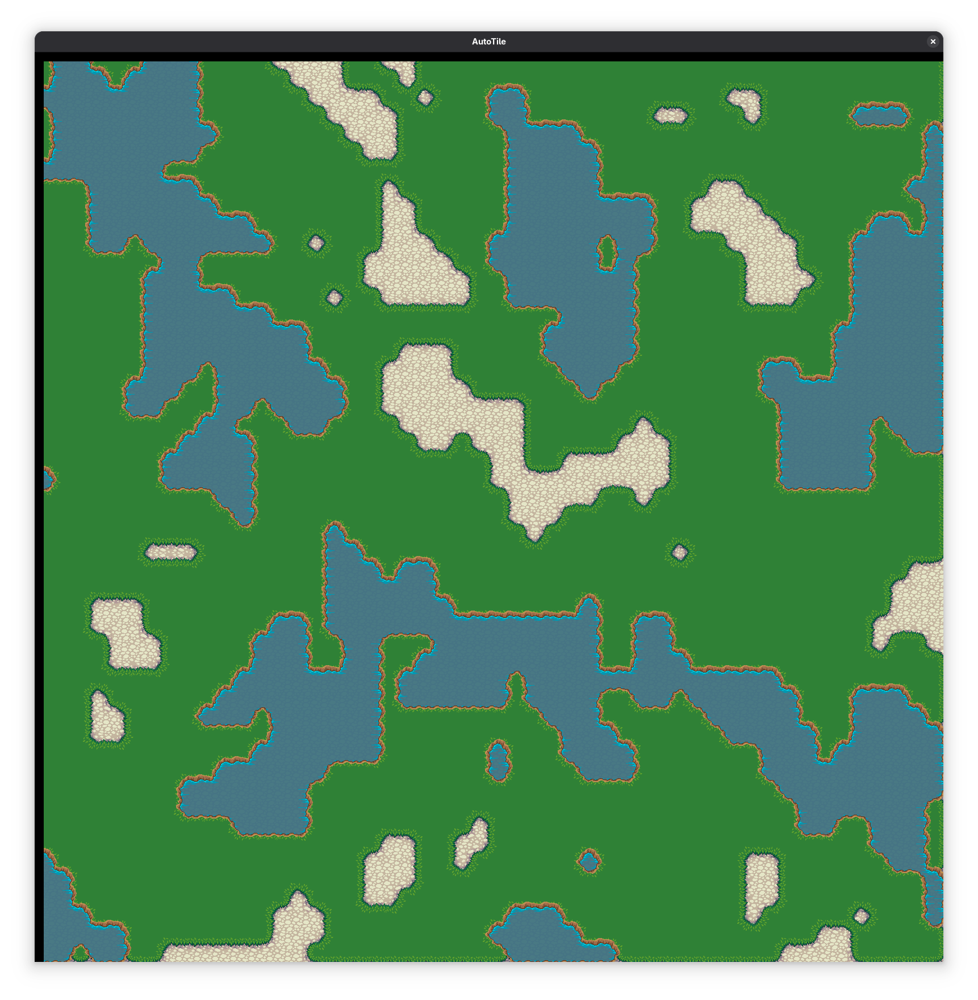

# odin-autotile



Creates an array for generating an autotile values and correct tile positioning as well.

## Example Usage

A more detailed usage is in `main.odin`.

make sure to imnport the package as well as:

`import auto "autotile"`

You simply initialise it first with width, height and type of tileset which can be choosed from `wang_corner`, `wang_edge` and `blob` each has an example image you can use.

ypu simply pass in your level and each unique tile key and this will return an array of the new grid with layers to allow for overlapping. You can then pass the value into `select_tile_type` which returns x and y position for a tileset which is based on the locations seen in the example images.

```odin
grid_width := 50
grid_height := 50
  
grid := gen_map(grid_width,grid_height)
defer delete(grid)

auto.initialise_bit_level(grid_width, grid_height, .wang_corner)    
new_grid := auto.create_bitmask_layered(&grid, []int{0, 1, 2})

tile_locations := [3][2]int{{4,0},{0,0},{0,4}}

for x in 0..<grid_width {
  for y in 0..<grid_height {
    size := y * grid_width + x                
    
    
    for tile in new_grid[size] {
        value := tile.key
        autotile := tile.bit
        pos := auto.select_tile_type(autotile)
        pos += tile_locations[value]
        // your logic for rendering the tile
    }
  }
}

```
